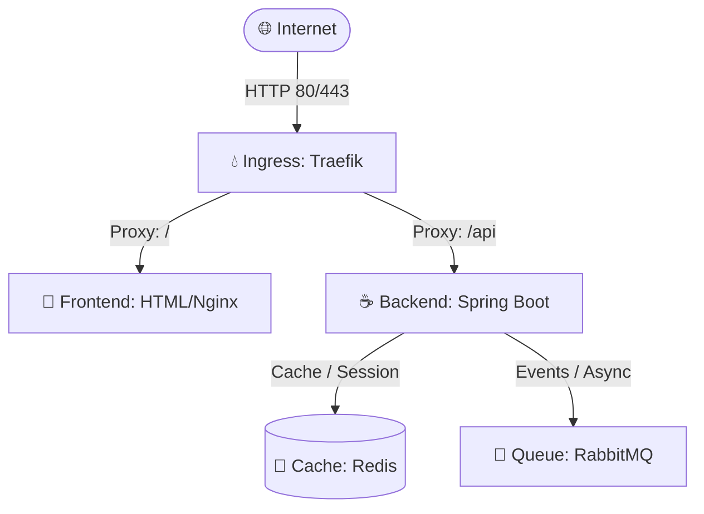

# Architecture & Data Flow Map

## System Topology & Data Flow

## Rapport de Sécurité Flash

### Vulnérabilités (Trivy)

| Sévérité | Nombre |
|----------|--------|
| CRITICAL | 0 |
| HIGH     | 0 |
| MEDIUM   | 0 |

### Linting Dockerfile (Hadolint)

*Aucun problème Dockerfile détecté.*

## 📊 Conformité & Production (Kube-Linter)

| Composant Helm | Règle Violée | Recommandation |
|----------------|--------------|----------------|
| ingress-traefik/deployment.yaml | no-readiness-probe | Add readiness probe |

## ⚖️ Conformité des Licences Open Source

| Dépendance | Langage | Licence | Statut |
|------------|---------|---------|--------|
| test-dep | Java | GPL | **RISQUE CRITIQUE (Copyleft)** |

## 📉 Dette Technique & Complexité

| Fichier | Fonction | Score de Complexité |
|---------|----------|---------------------|
| backend-api/src/main/java/com/example/Main.java | main | 20 ⚠️ |
