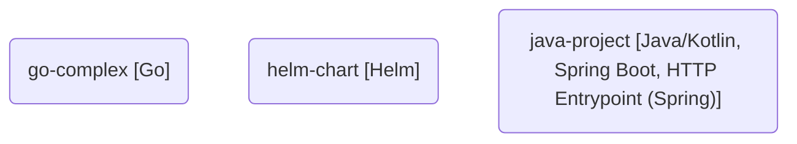

# Architecture & Data Flow Map

## System Topology



## Dependencies and Data Flow

```mermaid
graph LR
  %% No dependencies detected
```

## Rapport de Sécurité Flash

### Vulnérabilités (Trivy)

| Sévérité | Nombre |
|----------|--------|
| CRITICAL | 0 |
| HIGH     | 0 |
| MEDIUM   | 0 |

### Linting Dockerfile (Hadolint)

*Aucun problème Dockerfile détecté.*

## 📊 Conformité & Production (Kube-Linter)

| Composant Helm | Règle Violée | Recommandation |
|----------------|--------------|----------------|
| helm-chart/deployment.yaml | no-liveness-probe | Specify a livenessProbe. |
| helm-chart/deployment.yaml | no-readiness-probe | Specify a readinessProbe. |
| helm-chart/deployment.yaml | unset-cpu-requirements | Set cpu limits and requests. |
| helm-chart/deployment.yaml | unset-memory-requirements | Set memory limits and requests. |

## ⚖️ Conformité des Licences Open Source

| Dépendance | Langage | Licence | Statut |
|------------|---------|---------|--------|
| Root Pom License | Java | GPL-3.0 | **RISQUE CRITIQUE (Copyleft)** |

## 📉 Dette Technique & Complexité

*gocyclo non installé - Analyse AST native fallback utilisée*

| Fichier | Fonction | Score de Complexité |
|---------|----------|---------------------|
| go-complex/main.go | UltraComplexFunction | 26 ⚠️ |
| go-complex/main.go | main | 1 |
