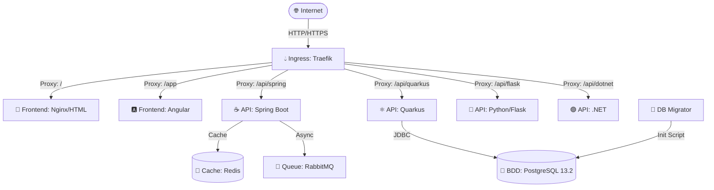

```mermaid
graph TD
    Client([🌐 Internet]) -->|HTTP/HTTPS| Traefik[💧 Ingress: Traefik]

    Traefik -->|Proxy: /| Nginx[🎨 Frontend: Nginx/HTML]
    Traefik -->|Proxy: /app| Angular[🅰️ Frontend: Angular]

    Traefik -->|Proxy: /api/spring| Spring[☕ API: Spring Boot]
    Traefik -->|Proxy: /api/quarkus| Quarkus[⚛️ API: Quarkus]
    Traefik -->|Proxy: /api/flask| Flask[🐍 API: Python/Flask]
    Traefik -->|Proxy: /api/dotnet| DotNet[🟣 API: .NET]

    Spring -->|Cache| Redis[(🛑 Cache: Redis)]
    Spring -->|Async| Rabbit[🐇 Queue: RabbitMQ]

    Quarkus -->|JDBC| Postgres[(🐘 BDD: PostgreSQL 13.2)]
    Migrator[📜 DB Migrator] -->|Init Script| Postgres
```